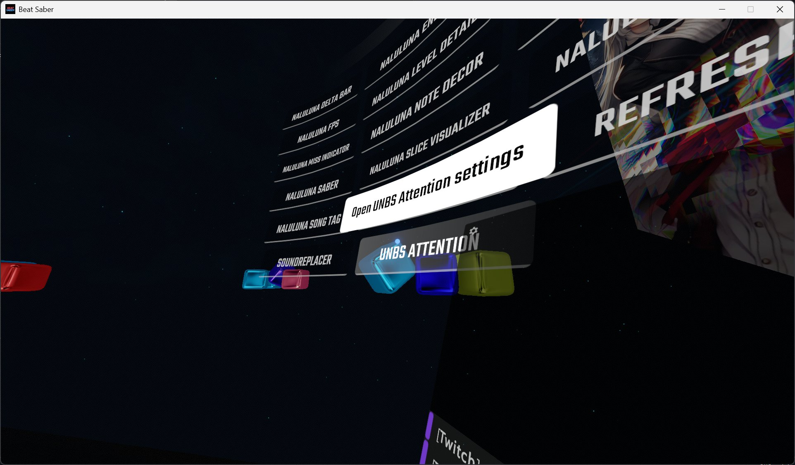
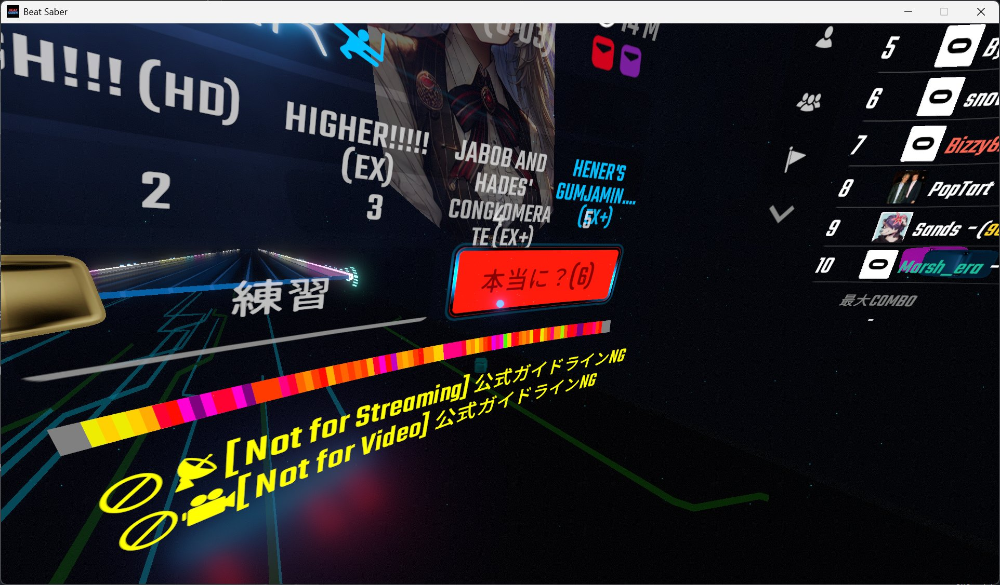

# USAGI.NETWORK BeatSaber Attention

Beat Saber 向けの〝⚠️アテンション情報〟を表示するプラグインです。

## スクショ

| 設定画面 | アテンション表示 |
| --- | --- |
|  |  |

## できること

- 曲選択中に「アテンション情報」を表示
- 複数設定可能な Google スプレッドシートからのアテンションデータの購読
- カテゴリーごとに表示 ON/OFF
- カテゴリーごとのプリフィックス付き表示
- 表示位置の X/Y 微調整
- アテンション発生中のプレイボタンの「本当に？」確認

## 導入方法

- [リリース](https://github.com/USAGI-NETWORK/unbs-attention/releases)のアセットで配布の UnbsAttention.dll を手動ないし BSManager などを使い Beat Saber の Plugins フォルダーへ配置
- 動作に必要な他のプラグインが未導入なら同様に配置

## 使い方: とりあえずデフォルト動作させてみたい方

- 上記の導入方法でプラグインを配置するだけでたぶんそれらしくいい感じに動作します。
- ビートセイバー内での挙動（色、表示位置の微調整、プリフィックスの編集など）はメインメニュー左側の MODS の `UNBS Attention` から設定できます。
- アテンション表示の条件や理由をカスタマイズしたい場合は以下の「使い方: アテンション情報の購読と表示」を参照してください。

## 使い方: アテンション情報の購読と表示

- アテンション情報は一定の書式で作成された任意の公開された Google スプレッドシートから購読できます。
- もしデフォルトのスプレッドシートとは異なる感覚でアテンションを表示したいと感じたり、独自のユーザーまたはグループで管理するアテンション情報を扱いたい場合は、以下の手順でスプレッドシートを作成/購読追加/購読削除などしてください。

### 購読の管理

1. メインメニュー左側 MODS の `UNBS Attention` を開く
2. 中央カラムで購読先を管理
   - 追加: 「クリップボードから購読URLを追加」ボタンを押すと、クリップボードに入っている URL を購読先として追加できます。
   - 削除: 「選択URLを削除」ボタンを押すと、選択中の URL(リストでの表示はそのID部分冒頭一部...) を購読先から削除できます。
   - 開く: 「選択URLを開く」ボタンを押すと、選択中の URL(リストでの表示はそのID部分冒頭一部...) をブラウザで開くことができます。
3. `今すぐ更新` を押して取り込み

### スプレッドシートの作成と書式について

デフォルト入りのスプレッドシートは本プラグインの作者のうさぎ博士ちゃんことDr.USAGIと本プラグイン制作のきかっけとなった配信者コミュニティーのフレンズである風野しあ、うさねくれあ、あきちゃらによって管理されています。アテンションの感覚がだいたい同様の民はそのままでも使いやすいかもしれません。

- <https://docs.google.com/spreadsheets/d/1HwMqwaHzlyidgGnIu5wTXosWzxgSI8dW0EO1yrgvAOg/edit?usp=sharing>

書式についての簡単な説明も「編集の仕方」シートに記載してあるので参考にしてください。

デフォルトのスプレッドシートの編集に参加したい方（アテンションの感覚がだいたい同様かもしれない民）は、編集権限をリクエストした上で、Discord/USAGI.NETWORKまたはXなどでAuthorのうさぎ博士ちゃんことDr.USAGI/USAGI.NETWORKへご連絡ください。なりすましや荒らしなどの迷惑行為を防止するため権限リクエストのみでは編集権限を付与できないので、必ずご連絡ください。

## ビルド

ここから先はOSS開発者向けの内容になります。
プラグインを使いたいだけの民は読まなくても大丈夫です。

### VS Code で通常ビルド

1. .NET Framework 4.7.2 Targeting Pack を入れる
1. .NET SDK を入れる
1. 実行:

```powershell
dotnet restore
dotnet build
```

### BSIPA 有効ビルド

既定では BSIPA 参照を無効にして軽く開発できます。
BSIPA で動かす場合は `EnableBsipa=true` を付けます。

1. `IPA.Loader.dll` を `Libs/` に置く（または `BsipaLibDir` を指定）
1. 実行:

```powershell
dotnet build -p:EnableBsipa=true
```

カスタム参照パス例:

```powershell
dotnet build -p:EnableBsipa=true -p:BsipaLibDir="C:/path/to/Beat Saber_Data/Managed"
```

出力 DLL は `bin/Debug/net472/UnbsAttention.dll` です。Beat Saber の `Plugins` へ配置して使います。

## スプレッドシートのカラムと設定値

- `category`
- `bsr`
- `info_includes`
- `info_regex`
- `desc_includes`
- `desc_regex`
- `reason`

補足:

- `bsr`, `info_includes`, `desc_includes` は `;` `,` `|` 区切り対応
- `info_includes`, `desc_includes` は大文字小文字を区別せず照合

各カラムの設定値、設定例は前述のデフォルトのスプレッドシートの内容を参照してください。

## License

- [MIT License](https://opensource.org/licenses/MIT)

## Author

- [USAGI.NETWORK](https://usagi.network)
