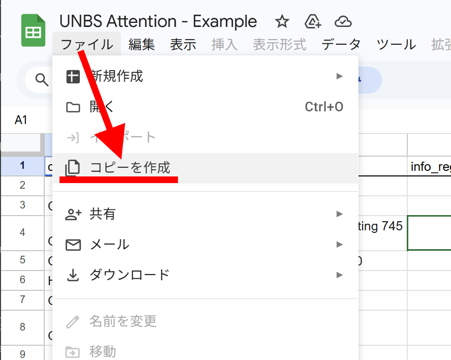

# UNBS-Attention; USAGI.NETWORK BeatSaber Attention

Beat Saber 向けの 〝⚠️アテンション情報〟 を表示するプラグインです。
プレイヤーが各マップに対して、自分用の注意メモや視認性の高い補足情報を表示できます。

> ！！使用上の注意！！
>
> - アテンション情報はあくまで「このマップはこういう理由で注意が必要かもしれない」というプレイヤーが自分用の注意メモを備忘録的に表示するためのものです。
> - アテンション情報の内容や表示は原則的に"プレイヤーの個人の判断"で設定、編集されるものです。表示内容には本プラグインの作者、ビーセイ界隈、マッパー、アーティストなどとは一切関係ありません。
> - アテンション情報の内容や表示を理由にプラグインの利用者、マッパー、アーティストなど誰かを批判する用途や目的では使用しないでください。
>   - 特に第三者の目に付く配信や動画で活動される方は表示するアテンション情報の理由の表現などが不用意な誤解や摩擦を生んだり、トゲトゲチクチクした表現にならないように十分に注意してください。プラグイン作者は誰もが安心してビートセイバーを末永く楽しめる環境が続く事を願っています。
> - このプラグインの作者もビートセイバーのプレイヤーであり、Twitch配信者であり、マッパーであり、作詞作曲者でもあります。`NotForStreaming`, `NotForVideo` カテゴリーも相手への敬意と優しさをもって接したい方が望まぬ軋轢を避ける目的で利用するために用意したものです。すべての立場からお互いに対して敬意と優しさをもって接することができるビートセイバー界隈であってほしいと願っています。
>
> 以上に同意できる方のみ本プラグインの使用を許諾します。

## スクショ

| 設定画面 | アテンション表示 |
| --- | --- |
|  |  |

## できること

- 曲選択中に「アテンション情報」を表示
- 複数設定可能な Google スプレッドシートからのアテンションデータの購読
- カテゴリーごとに表示 ON/OFF
- カテゴリーごとのプリフィックス付き表示
- 表示位置の X/Y 微調整
- アテンション発生中のプレイボタンの「本当に？」確認

## 導入方法

- [リリース](https://github.com/usagi/unbs-attention/releases)のアセットで配布の UnbsAttention.dll を手動ないし BSManager などを使い Beat Saber の Plugins フォルダーへ配置
- 動作に必要な他のプラグインが未導入なら同様に配置

## 使い方: とりあえずデフォルト動作させてみたい方

- 上記の導入方法でプラグインを配置するとデフォルト状態で [UNBS Attention - Example](https://docs.google.com/spreadsheets/d/14Wxm_M7sZh_kCSaLCuf5TWphaXaBiBqqQGb5g3Zgg3g/edit?usp=sharing) スプレッドシートのアテンション情報を購読した状態で動作します。
  - `!bsr 3a460` などエグザンプルに含まれる条件のマップを選択すると、プレイボタン下部にアテンション情報が表示され、プレイボタンを押すと「本当に？」確認が入るようになります。
- ビートセイバー内での挙動（色、表示位置の微調整、プリフィックスの編集など）はメインメニュー左側の MODS の `UNBS Attention` から設定できます。
- アテンション表示の条件や理由をカスタマイズしたい場合は以下の「使い方: アテンション情報の購読と表示」を参照してください。

## 使い方: アテンション情報の購読と表示

- アテンション情報は一定の書式で作成された任意の公開された Google スプレッドシートから購読できます。
- 誰かが作成して公開してくれているスプレッドシートを購読してもいいですし、自分で作成してもいいです。
  - Google Spreadsheets は共同編集もできるのでアテンションの感覚が似た友人知人や所属するいつメンのコミュニティーで共同編集して使いたい方が購読する運用も便利かもしれません。

### 購読の管理

1. メインメニュー左側 MODS の `UNBS Attention` を開く
2. 中央カラムで購読先を管理
   - 追加: 「クリップボードから購読URLを追加」ボタンを押すと、クリップボードに入っている URL を購読先として追加できます。
   - 削除: 「選択URLを削除」ボタンを押すと、選択中の URL(リストでの表示はそのID部分冒頭一部...) を購読先から削除できます。
   - 開く: 「選択URLを開く」ボタンを押すと、選択中の URL(リストでの表示はそのID部分冒頭一部...) をブラウザで開くことができます。
3. `今すぐ更新` を押して取り込み

### スプレッドシートの作成と書式について

1. [UNBS Attention - Example](https://docs.google.com/spreadsheets/d/14Wxm_M7sZh_kCSaLCuf5TWphaXaBiBqqQGb5g3Zgg3g/edit?usp=sharing) スプレッドシートを開く
2. 「コピーを作成」
3. お好みで自分だけのアテンション情報を編集
4. 「共有」から「リンクを知っている全員に変更」などで公開共有URLを取得
5. 上記の「購読の管理」の手順で購読

※自分用のスプレッドシートを追加する際に、不要なら初期状態で設定されているスプレッドシートは削除すると良いでしょう。



## ビルド

ここから先はOSS開発者向けの内容になります。
プラグインを使いたいだけの民は読まなくても大丈夫です。

### VS Code で通常ビルド

1. .NET Framework 4.7.2 Targeting Pack を入れる
1. .NET SDK を入れる
1. 実行:

```powershell
dotnet restore
dotnet build
```

### BSIPA 有効ビルド

既定では BSIPA 参照を無効にして軽く開発できます。
BSIPA で動かす場合は `EnableBsipa=true` を付けます。

1. `IPA.Loader.dll` を `Libs/` に置く（または `BsipaLibDir` を指定）
1. 実行:

```powershell
dotnet build -p:EnableBsipa=true
```

カスタム参照パス例:

```powershell
dotnet build -p:EnableBsipa=true -p:BsipaLibDir="C:/path/to/Beat Saber_Data/Managed"
```

出力 DLL は `bin/Debug/net472/UnbsAttention.dll` です。Beat Saber の `Plugins` へ配置して使います。

## スプレッドシートのカラムと設定値

- `category`
- `bsr`
- `info_includes`
- `info_regex`
- `desc_includes`
- `desc_regex`
- `reason`

補足:

- `bsr`, `info_includes`, `desc_includes` は `;` `,` `|` 区切り対応
- `info_includes`, `desc_includes` は大文字小文字を区別せず照合

各カラムの設定値、設定例は前述のデフォルトのスプレッドシートの内容を参照してください。

## License

- [MIT License](https://opensource.org/licenses/MIT)

## Author

- [USAGI.NETWORK](https://usagi.network)
